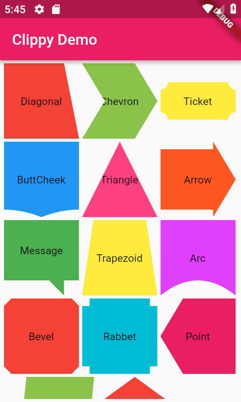
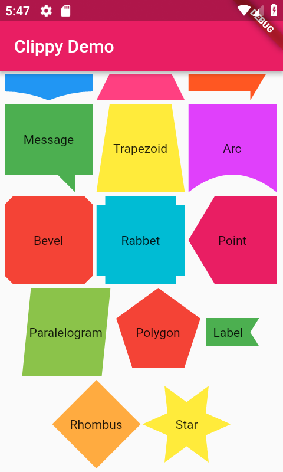
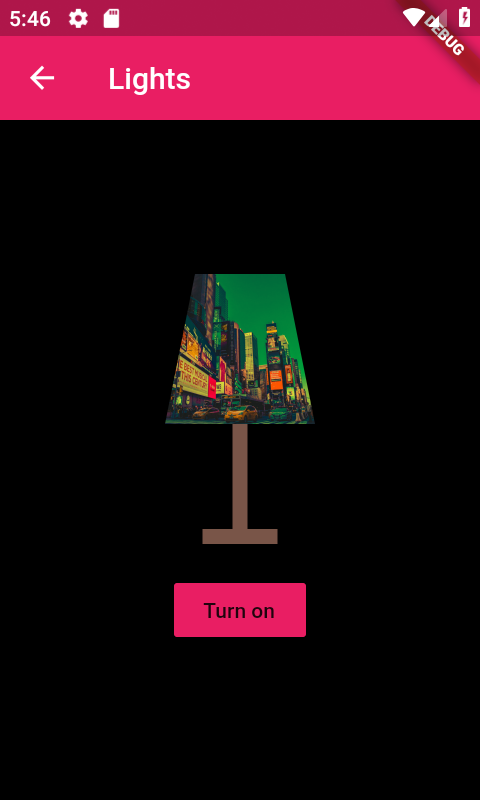
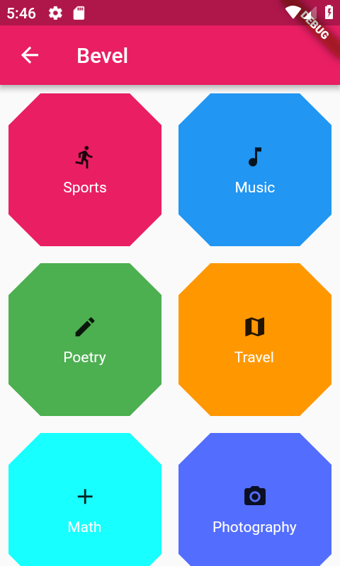
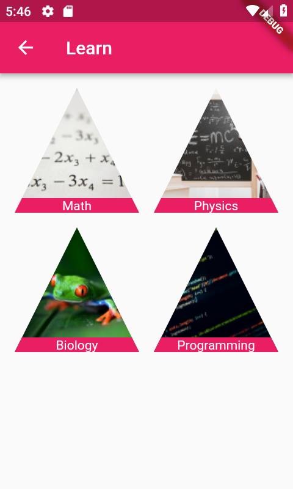

# example

Usages of clippy_flutter.

All Shapes S1           |  All Shapes S2
:-------------------------:|:-------------------------:|
  |   |

Diagonal           |  Arc |  Chevron | Message| Trapezoid
:-------------------------:|:-------------------------:|:-------------------------:|:-------------------------:|:-------------------------:
  |   | | | 

Arrow           |  Bevel |  Buttcheek | Ticket| Triangle
:-------------------------:|:-------------------------:|:-------------------------:|:-------------------------:|:-------------------------:
  |   | | | 
